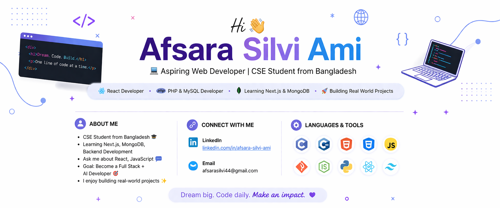

<h1 align="center">Hi 👋, I'm Afsara Silvi Ami</h1>
<h3 align="center">💻 Aspiring Web Developer | CSE Student from Bangladesh</h3>

---

### 🚀 About Me
- 🎓 CSE Student from Bangladesh  
- 🌱 Currently learning **Next.js, MongoDB, Backend Development**  
- 💬 Ask me about **React, JavaScript**  
- 🎯 Goal: Become a **Full Stack + AI Developer**  
- ⚡ I enjoy building real-world projects

---

<h3 align="left">Connect with me:</h3>

📫 Email: **afsarasilvi44@gmail.com**

---

<h3 align="left">Languages and Tools:</h3>

  
  

  

  

  

  

  

  

  

  

  

---

### 🚀 Featured Projects
- 🏥 **DigiTools** (HTML, Tailwind CSS, DaisyUi, JS(ES6), React)
- 🍱 **English Janala** (HTML, Tailwind CSS, JS, DOM)
- 📚**Payoo Mobile App** (HTML, Tailwind CSS, JS, DOM)

---
