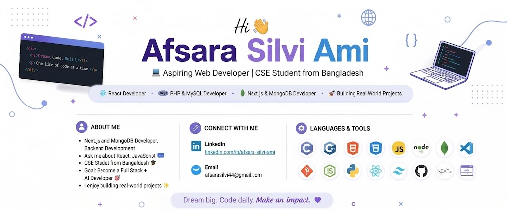

<h1 align="center">Hi 👋, I'm Afsara Silvi Ami</h1>
<h3 align="center">💻 MERN Stack Developer | CSE Student from Bangladesh</h3>

  

---

### 👩‍💻 About Me

I am a Computer Science graduate and passionate MERN Stack Developer who enjoys building modern, responsive, and user-friendly web applications. I primarily work with React, Next.js, and the MERN stack to create real-world projects. I love learning new technologies and continuously improving my development skills.

## 🌱 Current Activities

- 🔭 Currently working on full-stack web applications
- 🌱 Learning **Backend Development** and **TypeScript**
- 💡 Exploring advanced features of **Next.js** and the **MERN Stack**
- 🚀 Building real-world projects to strengthen my development skills

---

<h3 align="left">Connect with me:</h3>

📫 Email: **afsarasilvi44@gmail.com**

---

<h2 align="left">💻 Tech Stack</h2>

<h3>🎨 Frontend</h3>

<h3>⚙️ Backend</h3>

<h3>🗄️ Database</h3>

<h3>🛠️ Programming Languages</h3>

<h3>🔧 Tools</h3>

---

### 🚀 Featured Projects

- 💼 **AlignTask - A full-stack role-based freelancing platform**  
  HTML5, Tailwind CSS, Next.js, HeroUI, Node.js, BetterAuth, MongoDB, Express.js, Stripe, JWT

- 🖼️ **AimArena - A full-stack Sports Facility Booking Platform**  
  HTML5, Tailwind CSS, Next.js, HeroUI, BetterAuth, MongoDB, Express.js, JWT
  
- 🖼️ **Tiles Gallery**  
  HTML5, Tailwind CSS, Next.js, HeroUI, BetterAuth, MongoDB

- 👤 **Kin Keeper**  
  HTML%, Tailwind CSS, DaisyUI, React

- 🏥 **DigiTools**  
  HTML, Tailwind CSS, DaisyUI, JavaScript (ES6), React

- 🍱 **English Janala**  
  HTML, Tailwind CSS, JavaScript, DOM

---
## 📊 GitHub Stats

